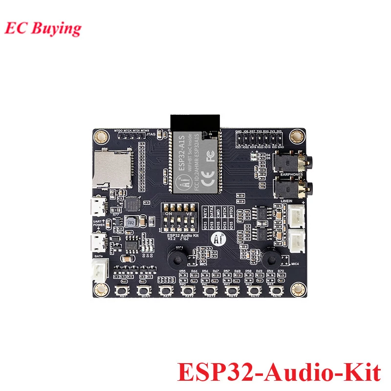

# K6BP RigControl

This is the K6BP RigControl software, an Amateur Radio transceiver
controller using an ESP-32 Audio Kit card commonly sold on AliExpress for
as little as $11.89 with free shipping (Mar 8, 2022).

## How to use example

### Hardware Required

ESP32 Audio Development Kit sold on AliExpress.com .




### Software Required

Download the ESPTouch App from the Android or iOS app store.

Install the esp-idf, using the instructions from
https://docs.espressif.com/projects/esp-idf/en/latest/esp32/get-started/index.html
### Build and Flash

On Linux, using *bash,* run the esp-idf environment script:
```
source esp-idf/export.sh
```
On Windows, see the installation instructions on how to run a PowerShell or
command prompt environment.

Build the project and flash it to the board, then run monitor tool to view serial output:

```
idf.py -p PORT flash monitor
```

Run the ESPTouch app to set the WiFi parameters of the board.

Open your web browser to the IP address printed by ESPTouch or the serial
monitor, in the form `http://*address*/`

If your home router provides dynamic DHCP addresses for devices on your LAN,
the device name will be *rigcontrol* until you set it. So you can try
opening *http://rigcontrol.lan/* if your router provides a *.lan* domain.
On some browsers, just typing *rigcontrol.lan/* will work.
