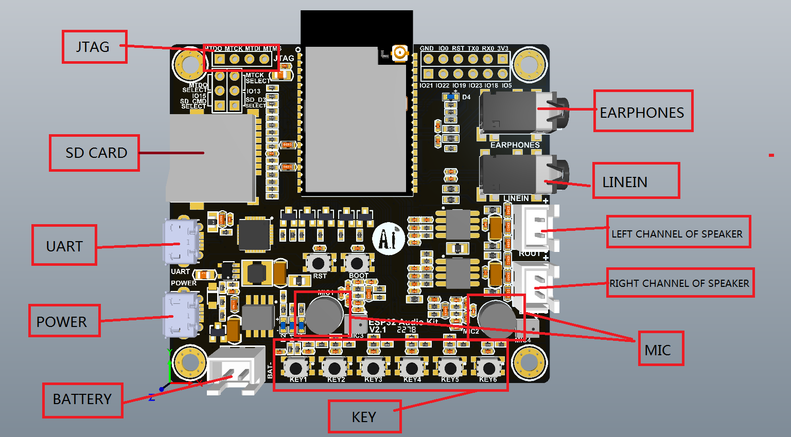

# K6BP RigControl

This is the K6BP RigControl software, an Amateur Radio transceiver
controller using an ESP-32 Audio Kit card commonly sold on AliExpress for
as little as $11.89 with free shipping (Mar 8, 2022).

The software is currently in "Hello World" stage: it can configure its
WiFi and start a web server. No ham radio control is implemented yet.

The device provides a WiFi based web interface to a phone, tablet,
or computer, and connects to a transceiver via audio line-level input
and output, serial transceiver control, and digital control lines for T/R,
etc. Some hardware will require voltage level conversion for the serial and
digital I/O, and inexpensive devices are recommended in the documentation.
There is no USB master. Control of devices via WiFi and Bluetooth is possible.

### Hardware Required

ESP32 Audio Development Kit sold on AliExpress.com .



The design of this appears to originate with AI-Thinker [(site)](https://docs.ai-thinker.com/en/esp32-audio-kit)
derived from a design by Espressif called the LyraT
[(site)](https://www.espressif.com/en/products/devkits/esp32-lyrat).
The boards available on AliExpress.com are either the AI-Thinker product or
follow it closely. The LyraT board has a different pinout.


* [Board schematic.](website/esp32-audio-kit_v2.2_sch.pdf)
* [Module specification.](website/esp32-a1s_v2.3_specification.pdf)
* [ESP32 audio design guide.](website/esp32_audio_design_guidelines__en.pdf)
* [Audio chip datasheet](website/ES8388 DS.pdf)

The board connects to the net via WiFi and provides two audio inputs and two
audio outputs. Microphone or line inputs are mutually exclusive. Line or
speaker outputs are also mutually exclusive. There is a USB serial interface
for debugging, and additional serial and digital outputs sufficient for
controlling serial rig control interfaces such as Yaesu's *CAT* and operating
a T/R input or other peripherals. CW and RTTY control is possible but not yet
implemented in software.

### Software Required

Download the ESPTouch App from the app store:
[Android](https://play.google.com/store/apps/details?id=com.khoazero123.iot_esptouch_demo) [iOS](https://apps.apple.com/us/app/espressif-esptouch/id1071176700)

Install the esp-idf, using the instructions from
https://docs.espressif.com/projects/esp-idf/en/latest/esp32/get-started/index.html
### Build and Flash

On Linux, using *bash,* run the esp-idf environment script. Assuming that
`esp-idf` is installed in the parent directory:
```
source ../esp-idf/export.sh
```
On Windows, see the installation instructions on how to run a PowerShell or
command prompt environment.

Build the project and flash it to the board, then run monitor tool to view serial output:

```
idf.py -p PORT flash monitor
```

Run the ESPTouch app to set the WiFi parameters of the board.

Open your web browser to the IP address printed by ESPTouch or the serial
monitor, in the form http://*address*/

If your home router provides dynamic DHCP addresses for devices on your LAN,
the device name will be *rigcontrol* until you set it. So you can try
opening *http://rigcontrol.lan/* if your router provides a *.lan* domain.
On some browsers, just typing *rigcontrol.lan/* will work.
